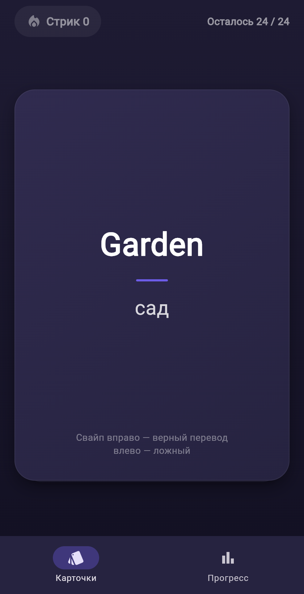
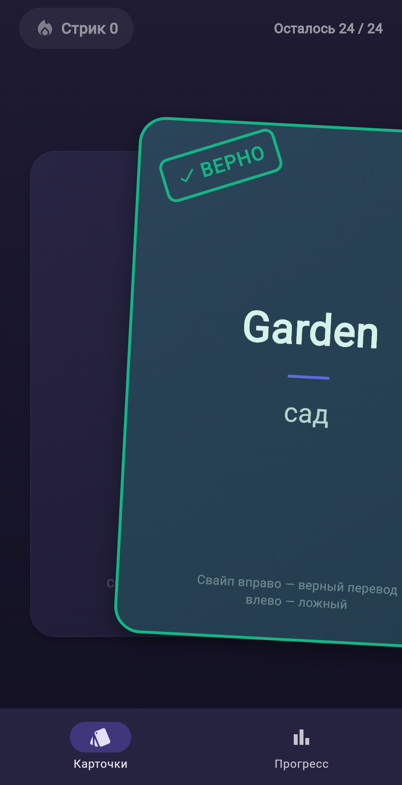
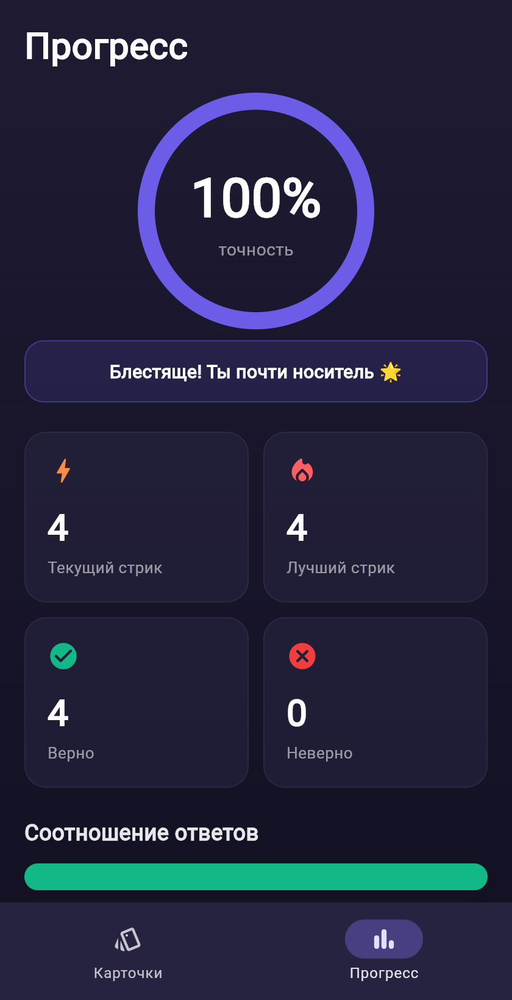

# Language Cards


Мини-приложение для изучения иностранных слов через карточки со свайпами.
Тестовое задание на позицию Flutter Developer.

|  | |
|---|---|
| **Стек** | Flutter 3.44 · Dart 3.12 · `provider` |
| **Экраны** | Карточки (свайп + стрик) · Прогресс |
| **Тесты** | 19 (логика стрика/статистики + widget-тесты жеста + smoke) |
| **CI** | GitHub Actions: `flutter analyze` + `flutter test` на каждый push |

| Карточки | Свайп с hint | Прогресс |
|---|---|---|
|  |  |  |

## Запуск

```bash
flutter pub get
flutter run          # выбери устройство/эмулятор/Chrome
```

Проверки:

```bash
flutter analyze      # 0 issues
flutter test         # 19 passed
```

## Что реализовано

### Экран «Карточки»
- Стопка карточек по одной, следующая «выглядывает» из-под текущей.
- **Свайп с физикой, написан вручную** (`lib/widgets/swipeable_card.dart`):
  карточка следует за пальцем, наклоняется тем сильнее, чем дальше её тянешь.
- **Snap back на настоящей пружине**: свайп засчитывается, только если превышен
  порог по **дистанции** (30% ширины карточки) **или по velocity** (быстрый
  флик). Иначе карточка возвращается в центр по `SpringSimulation`, в которую
  **передаётся скорость отпускания** — если отпустить с движением наружу,
  карточка сначала дотянется по инерции и только потом спружинит назад.
- **Цветовой hint**: зелёный оверлей + штамп «ВЕРНО» вправо, красный «НЕВЕРНО»
  влево; прозрачность растёт вместе с прогрессом свайпа.
- **Анимация вылета наследует скорость флика**: подтверждённая карточка
  продолжает своё движение (резкий флик улетает быстрее медленного дотяга),
  а не проигрывает фиксированный tween.
- **Ответ засчитывается в момент коммита свайпа**, пока карточка ещё летит:
  стрик пульсирует и хаптика срабатывает мгновенно, а следующая карточка сразу
  интерактивна — можно свайпать в темпе, не дожидаясь вылета предыдущей.
- **Haptic feedback**: `mediumImpact` на верный ответ, `heavyImpact` на
  неверный — по результату грейдинга из `GameController.answer()`.
- **Стрик** — количество правильных ответов подряд, показан прямо на экране;
  любая ошибка сбрасывает его в ноль. Бейдж **пульсирует при росте** стрика
  (`lib/widgets/streak_badge.dart`).
- **Пустой стейт** при окончании колоды: результат сессии + кнопка «Начать
  заново» и переход к прогрессу. Появляется с фейдом и только после того, как
  последняя карточка долетит за экран.

### Экран «Прогресс»
Переход — через нижнюю навигацию (`NavigationBar`).
- Текущий и лучший стрик, количество верных/неверных, точность в процентах.
- **Кольцо точности** с анимированным заполнением дуги.
- **Roll-up чисел** — все счётчики выкатываются от нуля **при каждом открытии
  вкладки** (`lib/widgets/animated_counter.dart`). Экран живёт в `IndexedStack`,
  где тикеры продолжают работать даже у скрытой вкладки — поэтому он
  перемонтируется через keyed subtree на каждый визит, иначе roll-up
  проигрался бы один раз невидимо при старте приложения
  (см. комментарий в `lib/screens/home_shell.dart`).
- **Мотивационное сообщение**, зависящее от точности.
- **История последних 10 ответов** — цепочка иконок ✓/✗.
- Полоса соотношения верных/неверных ответов.

## Логика игры

Каждая карточка — пара «слово → перевод», где перевод бывает настоящим или
ложным. Пользователь **судит** пару:

- свайп **вправо** = «перевод верный»,
- свайп **влево** = «перевод ложный».

Ответ засчитывается верным, когда суждение совпадает с реальностью
(`LanguageCard.isSwipeCorrect`). Колода — 24 захардкоженные карточки, 12 верных
и 12 ложных пар (`lib/data/card_deck.dart`), перемешивается при старте и рестарте.

## Архитектура и почему так

```
lib/
├── main.dart                    # точка входа, DI провайдера, тема
├── models/                      # LanguageCard, AnswerRecord — иммутабельные данные
├── data/card_deck.dart          # захардкоженная колода
├── state/game_controller.dart   # ВСЯ игровая логика (ChangeNotifier)
├── screens/                     # home_shell, cards_screen, progress_screen
├── widgets/                     # swipeable_card, streak_badge, animated_counter, …
└── theme/app_theme.dart         # цвета и ThemeData
```

**`ChangeNotifier` + `provider`, а не Bloc/Riverpod.** Приложение простое по
объёму состояния: одна сессия, один источник правды. Для такого масштаба
`ChangeNotifier` даёт всё нужное — тестируемость, отсутствие бойлерплейта,
понятность любому Flutter-разработчику — и не тянет кодогенерацию или лишние
абстракции. Riverpod/Bloc здесь были бы оверинжинирингом; при росте фич
(несколько колод, персистентность, сеть) миграция тривиальна, потому что вся
логика уже изолирована в одном классе.

**Вся игровая логика — в `GameController`, UI «тупой».** Правило стрика
(«любая ошибка → 0»), подсчёт точности, продвижение по колоде живут в одном
месте и покрыты юнит-тестами **без виджет-дерева**. Виджеты только читают
геттеры и вызывают `answer()` / `restart()`.

**Свайп написан руками, а не взят из пакета** (`flutter_card_swiper` и пр.).
Порог «snap back против подтверждения» и наклон — это и есть суть задания,
поэтому физику хотелось контролировать самому. Ключевые решения:

- **Snap back — это `SpringSimulation`, а не tween.** Скорость отпускания
  проецируется на трек «текущая позиция → центр» и передаётся пружине
  начальной скоростью, поэтому возврат продолжает движение руки, а слегка
  недодемпфированная пружина (ratio 0.8) даёт живой микро-овершут.
- **Коммит свайпа отделён от анимации вылета.** `SwipeableCard` отвечает
  только за жест: в момент пересечения порога он отдаёт наверх `SwipeCommit`
  (направление + позиция + velocity) и больше ничего не анимирует. Экран сразу
  грейдит ответ через `GameController.answer()` (мгновенные стрик и хаптика),
  а улетающую карточку рисует отдельный `FlyAwayCard` поверх стопки — он
  стартует ровно с того места и с той скоростью, где жест закончился. Побочный
  бонус: следующая карточка интерактивна ещё до конца вылета предыдущей.
- Направление вылета выбирается по знаку дистанции либо по знаку velocity,
  если сработал флик; защита `dx > 12px` отсекает нулевые «дёрганые» флики.

Это же — то самое нетривиальное решение, про которое рассказываю в Loom.

## Что намеренно упростил

- **Нет персистентности** — по ТЗ. Статистика живёт в памяти сессии.
- **Нет бэкенда/авторизации** — по ТЗ.
- **Одна тёмная тема** — без переключателя светлой темы.
- **Данные захардкожены** без слоя репозитория за интерфейсом: для 24 карточек
  абстракция не окупается.
- **RU-строки в коде** — без слоя локализации (`intl`/`.arb`), т.к. приложение
  одноязычное по условию.

## Тесты

```
test/
├── game_controller_test.dart   # 11 юнит-тестов: грейдинг, стрик, точность,
│                               #   прогресс по колоде, история, рестарт
├── swipeable_card_test.dart    # 5 widget-тестов жеста: drag→commit (в обе
│                               #   стороны), короткий drag→snap-back в центр,
│                               #   флик по velocity ниже порога дистанции
└── widget_test.dart            # 3 smoke: старт, свайп двигает колоду, прогресс
```

Юнит-тесты используют детерминированный `Random(42)`; тесты жеста гоняют
`timedDrag`/`fling` с контролируемой скоростью, чтобы отдельно проверить
дистанционный и velocity-пороги.

## Что улучшил бы при большем времени

- **Персистентность** (`shared_preferences`/`Hive`): лучший стрик и история
  между запусками.
- **Больше жизни в анимациях**: анимированное «всплытие» подложенной карточки
  на верхнюю позицию, конфетти на длинном стрике, шейк при ошибке.
- **Кнопки-дублёры свайпа** ✓/✗ для доступности и управления с клавиатуры;
  семантика для скринридеров.
- **Golden-тесты** на визуал карточки и штампов — жест уже покрыт
  widget-тестами.
- **Расширяемость данных**: загрузка колод из JSON/assets, темы, интервальное
  повторение (SRS).

## Как сдаётся

GitHub-репозиторий + Loom-видео (2–3 мин) с демонстрацией работы и разбором
ручной реализации свайпа как нетривиального решения.
